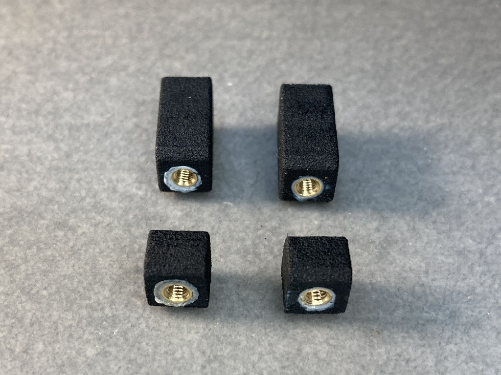
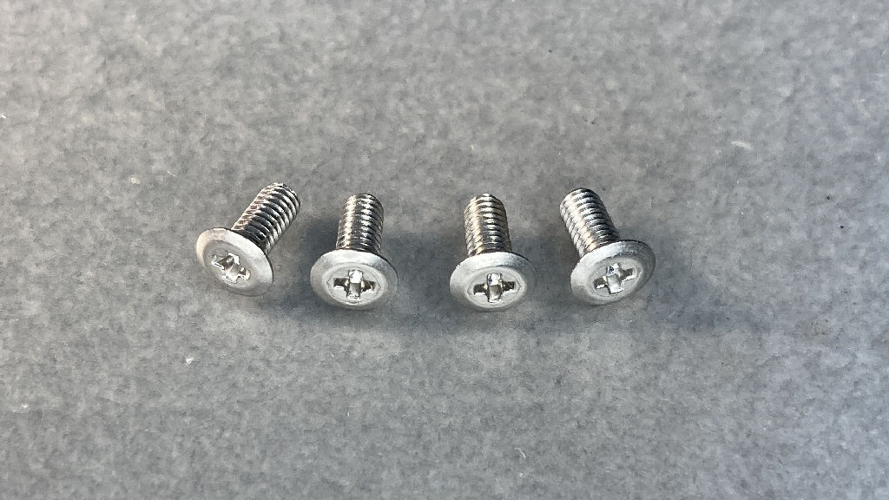
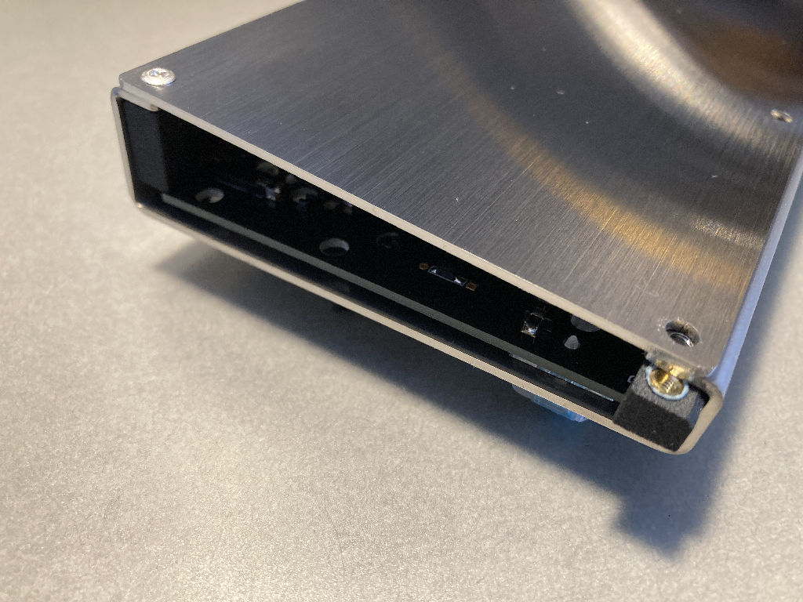
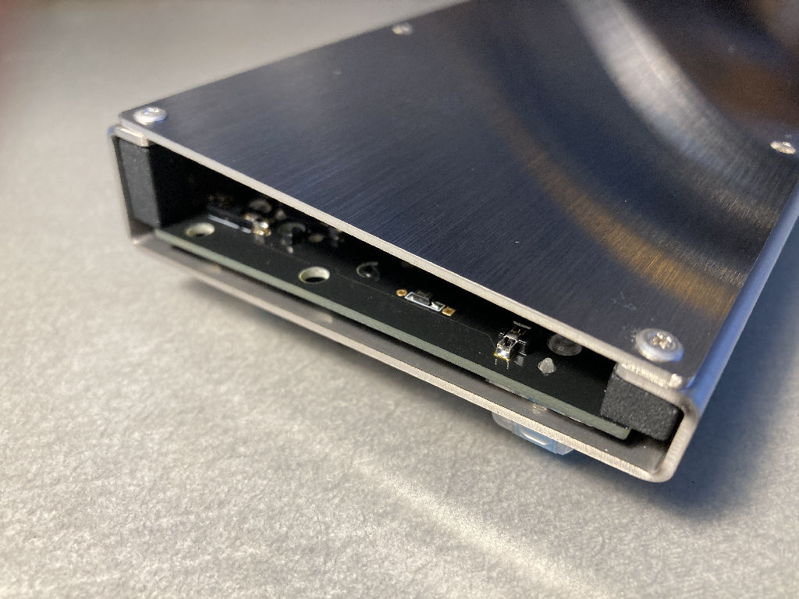
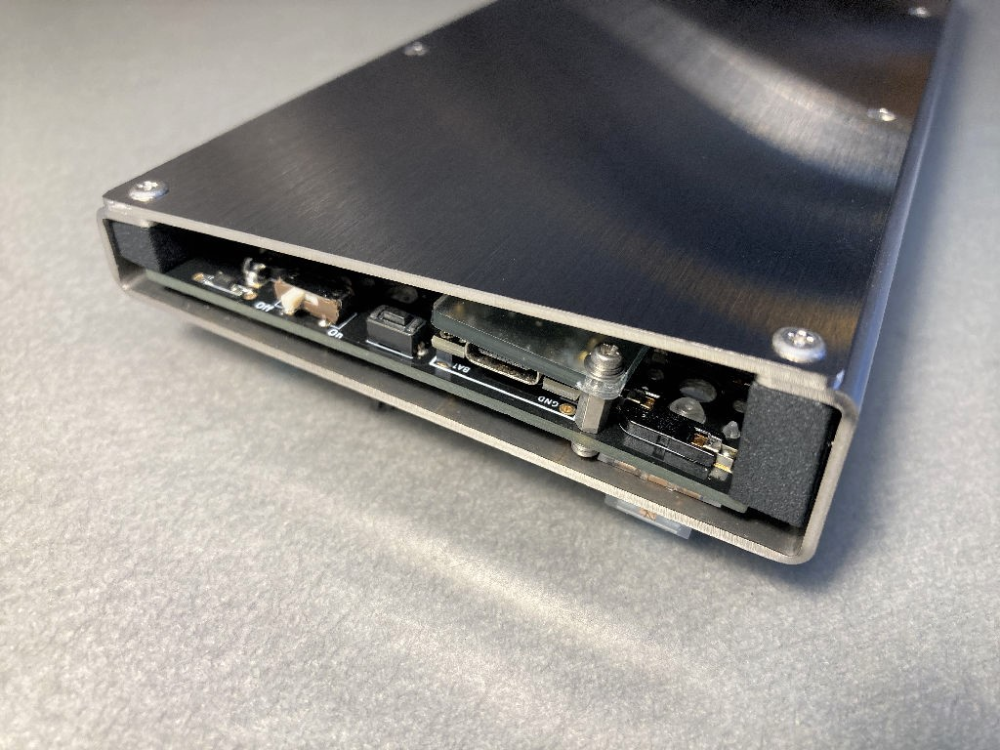
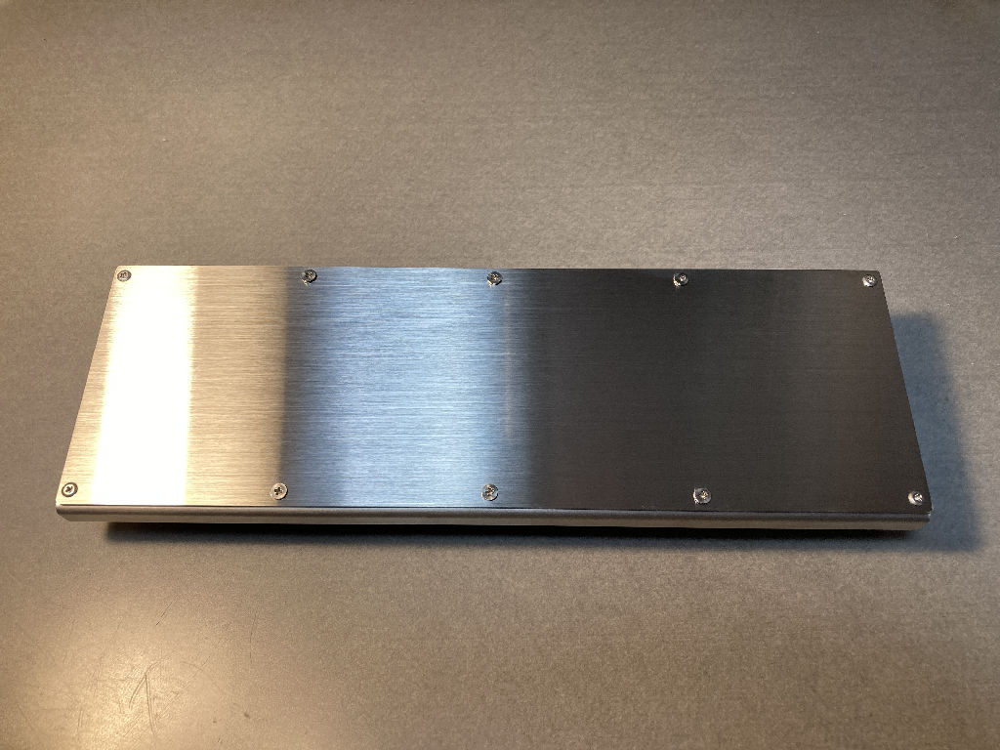
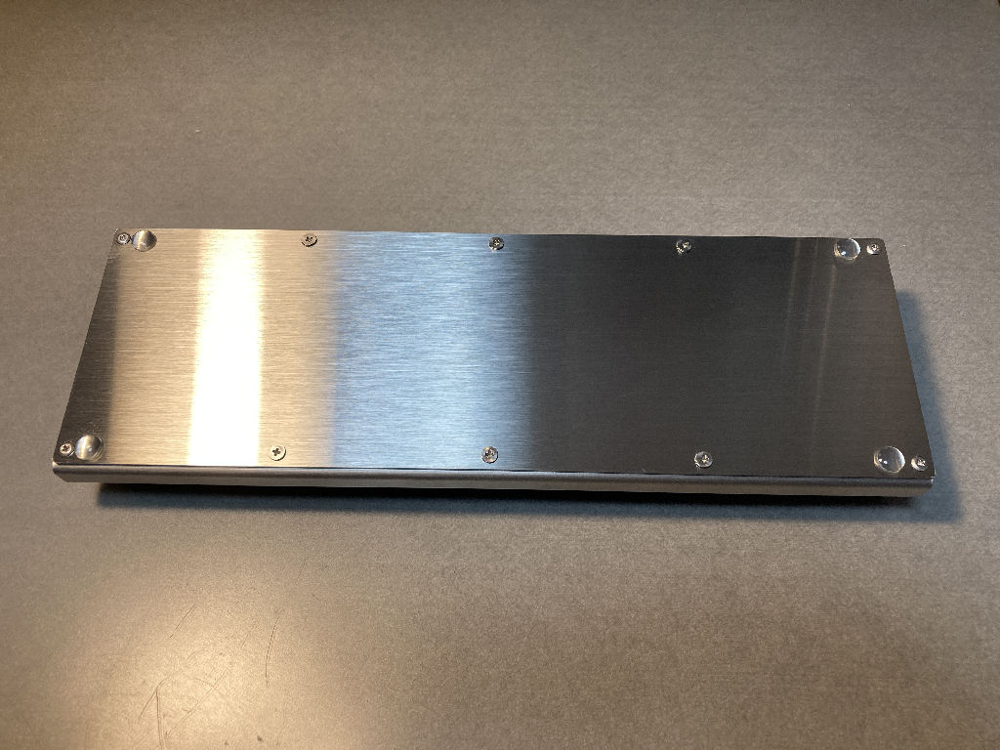

# Rect44 Build Guide
Caution)  
Please work carefully to avoid cutting your hands or other injuries due to the use of sheet metal bending cases.  
Also, there are numerous places where soldering must be done. To avoid burns or fires from the soldering iron, frequently disconnect the soldering iron from the power source when you leave the work.


## Preparation
### Check the included parts
- PCB ... 1
- Stainless case ... 1
- Stainless bottom plate ... 1
- ProMicro dropout prevention plate ... 1
- MX compatible switch sockets ... 54 + 1 spare
- Diodes (SMD type) ... 50 + 2 spares
- Schottky barrier diode (SMD type) ... 1
- Schottky barrier diode (TH type) ... 1
- Slide switch ... 1
- Tact switch ... 1
- AAA battery case ... 2
- 12pins sprig pin header ... 2
- M2 7mm spacer ... 2
- M2 6.5mm spacer ... 2
- M2 6mm spacer ... 2
- M2 screws (with PW and SW) ... 4
- PCB support (long and short) ... 2 each
- M2.6 low-head screws ... 4 + 1 spare
- M3 low-head screws ... 6 + 1 spare
- Cushion seal ... 4

|  |  |  |  |
| ---- | ---- | ---- | ---- |
| PCB | Stainless case | Stainless bottom plate | ProMicro dropout prevention plate |
|  |  |  |  |
| MX Compatible Sockets | Diodes | Schottky Barrier Diodes (SMD type) | Schottky Barrier Diodes (TH type) |
|  |  |  |  |
| Slide Switch | Tact Switch | AAA Battery Case | 12pins sprig pin header |
|  |  |  |  |
| M2 spacers (2 each of 7mm,6.5mm,6mm) | M2 screws|PCB support | M2.6 low head screws |
|  |  | | |
| M3 low head screw|cushion seal | | |

### Parts to be prepared separately
- ProMicro or ProMicro compatible: 1
- MX compatible keyswitches: 44-48 depending on layout
- Keycaps: Matching keyswitches and layout
- Stabilizers: Matching keyswitches and layout

### Required Tools
- Soldering iron (with temperature control function is recommended)
- Solder
- Stand for soldering iron
- Flux
- Flux cleaning solution
- Tweezers
- Screwdriver
- Nippers

### What you should have
- Tester
- Desoldering wire
- Reaction tweezers
- Magnifying glass or loupe
- Radio pliers
- Heat-resistant work mat
- Masking tape


## Firmware
I recommend using ["BLE Micro Pro"](https://nogikes.booth.pm/items/1177319) by ["nogikes"](https://nogikes.booth.pm/).
It is easy because it does not require the construction of an environment to build firmware, and it also allows for Bluetooth connectivity.

### In case of using BLE Micro Pro
Simply edit and customize CONFIG.JSN and KEYMAP.JSN as described in the following instructions and copy them to BLE Micro Pro.

If you are using a previously released product, you can use the same procedure as the "type-c version" if you are using the "boot loader v0.2 version" or later. If you use an earlier boot loader version, you will need to update the boot loader or build the firmware.

#### CONFIG.JSN
Copy and paste the following contents and save it as CONFIG.JSN to an arbitrary location. This file does not need to be changed even if the keymap changes.
```
{"config":
    {
            "version":2,
            "device_info":{"vid": "0xFEED", "pid": "0x0000", "name": "rect44", "manufacture": "koshinoya", "description":""},
            "matrix":{"rows":4, "cols":13, "device_rows":4, "device_cols":13,
            "debounce":1, "is_left_hand":1, "diode_direction":0,
            "row_pins":[1, 2, 19, 20],
            "col_pins":[18, 17, 16, 15, 14, 5, 6, 7, 8, 9, 10, 11, 12],
            "layout":[1, 2, 3, 4, 5, 6, 7, 8, 9, 10, 11, 12, 13, 0,
                    14, 15, 16, 17, 18, 19, 20, 21, 22, 23, 24, 25, 26, 0,
                    27, 28, 29, 30, 31, 32, 33, 34, 35, 36, 37, 38, 39, 0,
                    40, 41, 42, 43, 45, 46, 48, 49, 50, 51, 52]},
            "mode": "SINGLE", "startup":1,
            "peripheral":{"max_interval":60, "min_interval":30, "slave_latency":7},
            "central":{"max_interval":60, "min_interval":30, "slave_latency":0},
            "led":{"pin":255, "num":0},
            "keymap":{"locale": "US", "use_ascii":0}
}}
```

#### KEYMAP.JSN
KEYMAP.JSN is customized for the layout you choose.
Keycodes are the same as for [ QMK Keycordes ](https://docs.qmk.fm/#/keycodes).

[ BLE Micro Pro specific keycodes ](https://github.com/sekigon-gonnoc/BLE-Micro-Pro/blob/master/docs/edit_keymap_file.md#ble-micro-pro%E5%9B%BA%E6%9C%89%E3%81%AE%E3%82%AD%E3%83%BC%E3%82%B3%E3%83%BC%E3%83%89) is also available and should be introduced as appropriate.

The keys that may or may not be used depending on the layout are "13", "25", "28", "38", "43", "45", "46", and "48" in the CONFIG.JSN "layout" section.
- "13" key: Upper right-most key in ANSI layout, not available when using the ISO return key.
- "25" key: The key to the right of the semicolon in the ISO sequence, not available when the 2.25u return key is used.
- "28" key: The 1u key when the left Shift key is split into 1.25u and 1u keys.
- "38" key: The 1u key when the right Shift key is split into 1u and 1.75u keys.
- "43" key: The left 2.25u key when the 6.25u space key is split into three.
- "45" key: 6.25u space key.
- "46" key: The middle 2.75u key when the 6.25u space key is divided into three.
- "48" key: The right 1.25u key when the 6.25u space key is divided into 3 parts.

###### Sample for ANSI 44 key with 6.25u space key.
```
{"layers":
[["KC_ESC", "KC_Q", "KC_W", "KC_E", "KC_R", "KC_T", "KC_Y", "KC_U", "KC_I", "KC_O", "KC_P", "KC_MINS", "KC_BSPC",
"LCTL_T(KC_TAB)", "KC_A", "KC_S", "KC_D", "KC_F", "KC_G", "KC_H", "KC_J", "KC_K", "KC_L", "KC_SCLN", "KC_NO", "KC_ENT",
"KC_LSFT", "KC_NO", "KC_Z", "KC_X", "KC_C", "KC_V", "KC_B", "KC_N", "KC_M", "KC_COMM", "KC_DOT", "KC_NO", "RSFT_T(KC_SLSH)",
"LCTL_T(KC_DEL)", "KC_LGUI", "KC_LALT", "KC_NO", "LT(_FN,KC_SPC)", "KC_NO", "KC_NO", "KC_LEFT", "KC_DOWN", "KC_UP", "KC_RGHT",],

["KC_GRV", "KC_F1", "KC_F2", "KC_F3", "KC_F4", "KC_F5", "KC_F6", "KC_F7", "KC_F8", "KC_F9", "KC_F10", "KC_F11", "KC_F12",
"KC_TRNS", "KC_1", "KC_2", "KC_3", "KC_4", "KC_5", "KC_6", "KC_7", "KC_8", "KC_9", "KC_0", "KC_NO", "KC_EQL",
"KC_TRNS", "KC_NO", "KC_APP", "MO(_FN2)", "KC_NO", "KC_LBRC", "KC_RBRC", "KC_QUOT", "KC_TRNS", "KC_TRNS", "KC_NO", "KC_BSLS",
"KC_INS", "KC_TRNS", "KC_TRNS", "KC_NO", "KC_NO", "KC_HOME", "KC_PGDN", "KC_PGUP", "KC_END",],

["ADV_ID0", "ADV_ID1", "ADV_ID2", "ADV_ID3", "ADV_ID4", "KC_NO", "KC_NO", "KC_NO", "KC_PSCR", "KC_SLCK", "KC_PAUS", "KC_NO",


"KC_LCTL", "KC_TRNS", "KC_TRNS", "KC_NO", "KC_TRNS", "KC_NO", "KC_NO", "KC_NO", "KC_NO","","","]]}
```

###### Sample for ANSI 47 keys with space key split into 3 and right Shift key also split.
```
{"layers":
[["KC_ESC", "KC_Q", "KC_W", "KC_E", "KC_R", "KC_T", "KC_Y", "KC_U", "KC_I", "KC_O", "KC_P", "KC_MINS", "KC_BSPC",
"LCTL_T(KC_TAB)", "KC_A", "KC_S", "KC_D", "KC_F", "KC_G", "KC_H", "KC_J", "KC_K", "KC_L", "KC_SCLN", "KC_NO", "KC_ENT",
"KC_LSFT", "KC_NO", "KC_Z", "KC_X", "KC_C", "KC_V", "KC_B", "KC_N", "KC_M", "KC_COMM", "KC_DOT", "KC_SLSH", "RSFT_T(KC_UP)",
"LCTL_T(KC_DEL)", "KC_LGUI", "KC_LALT", "LT(1,KC_SPC)", "KC_NO", "RSFT_T(KC_SPC)", "KC_RALT", "MO(2)", "KC_LEFT", "KC_DOWN", "KC_RGHT",],

["KC_GRV", "KC_F1", "KC_F2", "KC_F3", "KC_F4", "KC_F5", "KC_F6", "KC_F7", "KC_F8", "KC_F9", "KC_F10", "KC_F11", "KC_F12",
"KC_TRNS", "KC_1", "KC_2", "KC_3", "KC_4", "KC_5", "KC_6", "KC_7", "KC_8", "KC_9", "KC_0", "KC_NO", "KC_EQL",
"KC_TRNS", "KC_NO", "KC_APP", "KC_NO", "KC_LBRC", "KC_RBRC", "KC_QUOT", "KC_TRNS", "KC_TRNS", "KC_BSLS", "RSFT_T(KC_PGUP)",
"LCTL_T(KC_INS)", "KC_TRNS", "KC_TRNS", "KC_TRNS", "KC_NO", "KC_TRNS", "KC_TRNS", "KC_TRNS", "KC_TRNS", "KC_HOME", "KC_PGDN", "KC_END",],

["ADV_ID0", "ADV_ID1", "ADV_ID2", "ADV_ID3", "ADV_ID4", "KC_NO", "KC_NO", "KC_NO", "KC_PSCR", "KC_SLCK", "KC_PAUS", "KC_NO",


"KC_LCTL", "KC_TRNS", "KC_TRNS", "KC_NO", "KC_NO", "KC_NO", "KC_TRNS", "KC_NO", "KC_NO", "KC_NO","]]}
```

###### Sample for 48 keys with ISO enter key
```
{"layers":
[["KC_ESC", "KC_Q", "KC_W", "KC_E", "KC_R", "KC_T", "KC_Y", "KC_U", "KC_I", "KC_O", "KC_P", "KC_DEL", "KC_NO",
"LCTL_T(KC_TAB)", "KC_A", "KC_S", "KC_D", "KC_F", "KC_G", "KC_H", "KC_J", "KC_K", "KC_L", "KC_SCLN", "KC_QUOT", "KC_ENT",
"KC_LSFT", "LSFT_T(KC_NUBS)", "KC_Z", "KC_X", "KC_C", "KC_V", "KC_B", "KC_N", "KC_M", "KC_COMM", "KC_DOT", "KC_SLSH", "RSFT_T(KC_UP)",
"LCTL_T(KC_INS)", "KC_LGUI", "KC_LALT", "LT(1,KC_SPC)", "KC_NO", "RSFT_T(KC_SPC)", "KC_RALT", "MO(2)", "KC_LEFT", "KC_DOWN", "KC_RGHT",],

["KC_GRV", "KC_F1", "KC_F2", "KC_F3", "KC_F4", "KC_F5", "KC_F6", "KC_F7", "KC_F8", "KC_F9", "KC_F10", "KC_BSPC", "KC_NO",
"KC_TRNS", "KC_1", "KC_2", "KC_3", "KC_4", "KC_5", "KC_6", "KC_7", "KC_8", "KC_9", "KC_0", "KC_MINS", "KC_EQL",
"KC_TRNS", "KC_NO", "KC_APP", "KC_NO", "KC_LBRC", "KC_RBRC", "KC_NUHS", "KC_TRNS", "KC_TRNS", "KC_BSLS", "RSFT_T(KC_PGUP)",
"KC_TRNS", "KC_TRNS", "KC_TRNS", "KC_TRNS", "KC_TRNS", "KC_NO", "KC_TRNS", "KC_TRNS", "KC_TRNS", "KC_HOME", "KC_PGDN", "KC_END",],

["ADV_ID0", "ADV_ID1", "ADV_ID2", "ADV_ID3", "ADV_ID4", "KC_NO", "KC_NO", "KC_NO", "KC_PSCR", "KC_SLCK", "KC_PAUS", "KC_NO",


"KC_TRNS", "KC_TRNS", "KC_TRNS", "KC_TRNS", "KC_NO", "KC_TRNS", "KC_TRNS", "KC_NO", "KC_NO", "KC_NO","]}
```

Copy and paste your favorite sample above and save it as KEYMAP.JSN. Of course, customization is also OK.

#### If you want to update the bootroader
If you want to update the bootloader and application via the [ QMK Configurator for BLE Micro Pro ](https://sekigon-gonnoc.github.io/BLE-Micro-Pro-WebConfigurator/#/home).
1. Connect the PC and BPM with a USB cable.
2. Open https://sekigon-gonnoc.github.io/BLE-Micro-Pro-WebConfigurator/#/home in Chrome.
3. Press the blue button at the bottom.
4. Select Keyboard > ble_micro_pro  
Select layout > ( blanc )  
Push Next.
5. Select bootloader version > ble_micro_pro_bootloader_0_11_0  
Push Update.  
Select the serial port to which the BMP is connected.  
Push Connect.  
Push Update again.  
Select the serial port to which the BMP is connected again.  
Push Connect.  
"Update succeeded. Go next step." is displayed.  
Push Next.
6. Select application version > ble_micro_pro_default_0_11_0  
Push Update.  
Select again the serial port to which the BMP is connected.  
Push Connect.  
"Update succeeded. Go next step." is displayed.  
Push Next.
7. Select Keyboard > ble_micro_pro  
Select layout > ( blanc )  
Push Update.
Select again the serial port to which the BMP is connected.  
Push Connect.  
"Update succeeded. Go next step." is displayed.  
Push Next.
8. Done.  
Now you can disconnect USB cable and reconnect it.
9. Edit CONFIG.JSN and KEYMAP.JSN

#### Writing
When the BLE Micro Pro is connected to a PC with a USB cable, it is recognized as if it were connected to a USB memory device.

|  |
| ---- |
| In the above figure, "name" in "device_info" of CONFIG.JSN is set to rect44-3, so it is recognized as such. |

CONFIG.JSN and KEYMAP.JSN are also available at the following links, so please rename them and use them.
https://github.com/sekigon-gonnoc/BLE-Micro-Pro/tree/master/AboutDefaultFirmware/keyboards/rect44

### In case of using ProMicro
#### Building the Environment
Basically here
[ The Complete Newbs Guide To QMK ](https://docs.qmk.fm/#/newbs)

#### Customize
You can use [ QMK Configurator ](https://config.qmk.fm/) and put `rect44` in the `KEYBOARD:` to see the ANSI 47 key version.
For other layouts (ANSI 44 and ISO 48 key layouts), copy and paste the following contents and save it as a `.json` file in a desired location, then press the `Import QMK Keymap JSON File button` in the QMK Configurator to load it. Please use the following.  


###### ansi_44key.json (ANSI 44 key layout example)
```
{
  "keyboard": "rect44",
  "keymap": "default",
  "commit": "",
  "layout": "LAYOUT_ansi_44key",
  "layers": [
    [
      "KC_ESC", "KC_Q", "KC_W", "KC_E", "KC_R", "KC_T", "KC_Y", "KC_U", "KC_I", "KC_O", "KC_P", "KC_MINS", "KC_BSPC",
      "LCTL_T(KC_TAB)", "KC_A", "KC_S", "KC_D", "KC_F", "KC_G", "KC_H", "KC_J", "KC_K", "KC_L", "KC_SCLN", "KC_ENT",
      "KC_LSFT", "KC_Z", "KC_X", "KC_C", "KC_V", "KC_B", "KC_N", "KC_M", "KC_COMM", "KC_DOT", "RSFT_T(KC_SLSH)",
      "LCTL_T(KC_DEL)", "KC_LGUI", "KC_LALT", "LT(1,KC_SPC)", "KC_LEFT", "KC_DOWN", "KC_UP", "KC_RGHT"
    ],
    [
      "KC_GRV", "KC_F1", "KC_F2", "KC_F3", "KC_F4", "KC_F5", "KC_F6", "KC_F7", "KC_F8", "KC_F9", "KC_F10", "KC_F11", "KC_F12",
      "KC_TRNS", "KC_1", "KC_2", "KC_3", "KC_4", "KC_5", "KC_6", "KC_7", "KC_8", "KC_9", "KC_0", "KC_EQL",
      "KC_TRNS", "KC_APP", "MO(2)", "KC_NO", "KC_NO", "KC_LBRC", "KC_RBRC", "KC_QUOT", "KC_TRNS", "KC_TRNS", "KC_BSLS",
      "KC_INS", "KC_TRNS", "KC_TRNS", "KC_HOME", "KC_PGDN", "KC_PGUP", "KC_END"
    ],
    [
      "KC_NO", "RGB_TOG", "RGB_HUI", "RGB_SAI", "RGB_VAI", "KC_NO", "KC_NO", "KC_NO", "KC_PSCR", "KC_SLCK", "KC_PAUS", "KC_NO",
      "KC_CAPS", "RGB_MOD", "RGB_HUD", "RGB_SAD", "RGB_VAD", "KC_NO", "KC_NO", "KC_NO", "KC_NO", "KC_NO", "KC_NO", "KC_NO",
      "KC_TRNS", "KC_NO", "KC_TRNS", "KC_NO", "KC_NO", "KC_NO", "KC_NO", "KC_NO", "KC_NO", "KC_NO", "KC_NO", "KC_NO",
      "KC_LCTL", "KC_TRNS", "KC_TRNS", "KC_TRNS", "KC_NO", "KC_NO", "KC_NO", "KC_NO"
    ]
  ]
}
```
###### iso_ 48key.json (ISO 48 key layout example)
```
{
  "keyboard": "rect44",
  "keymap": "default",
  "commit": "",
  "layout": "LAYOUT_iso_48key",
  "layers":[
    [
      "KC_ESC", "KC_Q", "KC_W", "KC_E", "KC_R", "KC_T", "KC_Y", "KC_U", "KC_I", "KC_O", "KC_P", "KC_BSPC", "KC_ENT",
      "LCTL_T(KC_TAB)", "KC_A", "KC_S", "KC_D", "KC_F", "KC_G", "KC_H", "KC_J", "KC_K", "KC_L", "KC_SCLN", "KC_QUOT",
      "KC_LSFT", "KC_NUBS", "KC_Z", "KC_X", "KC_C", "KC_V", "KC_B", "KC_N", "KC_M", "KC_COMM", "KC_DOT", "KC_SLSH", "RSFT_T(KC_UP)",
      "KC_LCTL", "KC_LGUI", "KC_LALT", "LT(1,KC_SPC)", "RSFT_T(KC_SPC)", "KC_RALT", "MO(2)", "KC_LEFT", "KC_DOWN", "KC_RGHT"
    ],
    [
      "KC_GRV", "KC_F1", "KC_F2", "KC_F3", "KC_F4", "KC_F5", "KC_F6", "KC_F7", "KC_F8", "KC_F9", "KC_F10", "KC_DEL", "KC_EQL",
      "KC_TRNS", "KC_1", "KC_2", "KC_3", "KC_4", "KC_5", "KC_6", "KC_7", "KC_8", "KC_9", "KC_0", "KC_MINS",
      "KC_TRNS", "KC_NO", "KC_APP", "KC_F11", "KC_F12", "KC_NO", "KC_LBRC", "KC_RBRC", "KC_NUHS", "KC_TRNS", "KC_TRNS", "KC_TRNS", "KC_PGUP",
      "KC_INS", "KC_TRNS", "KC_TRNS", "KC_TRNS", "KC_TRNS", "KC_TRNS", "KC_HOME", "KC_PGDN", "KC_END"
    ],
    [
      "KC_NO", "RGB_TOG", "RGB_HUI", "RGB_SAI", "RGB_VAI", "KC_NO", "KC_NO", "KC_NO", "KC_PSCR", "KC_SLCK", "KC_PAUS", "KC_NO",
      "KC_CAPS", "RGB_MOD", "RGB_HUD", "RGB_SAD", "RGB_VAD", "KC_NO", "KC_NO", "KC_NO", "KC_NO", "KC_NO", "KC_NO", "KC_NO",

      "KC_LCTL", "KC_TRNS", "KC_TRNS", "KC_NO", "KC_TRNS", "KC_TRNS", "KC_TRNS", "KC_TRNS", "KC_NO", "KC_NO", "KC_NO"
    ]
  ]
}
```

If you would like to add other modifications, please use QMK, where they have been merged.


## Assembly
From this point on, soldering work will be performed in more than 200 places.
The side where the component is to be installed is the side marked "Rect44 v1.2" in the lower left corner.

### Diode for key switch
The included diodes are surface-mount (SMD) type, but this board also allows through-hole (TH) type diodes to be mounted, so if you are not confident about mounting surface-mount type diodes, you can obtain through-hole type diodes separately and install them. For the diode to be used, I recommend "1N4148" which is easy to get.

|  |
| ---- |
| Solder the diode mark on the board in the direction of the diode line, matching the position of the bar with the direction in which the diode line is located. Pre-solder one pad in advance and solder the other side after soldering to that pad. |

### Schottky barrier diode
Both surface mount (SMD) and through-hole (TH) types are enclosed as accessory parts, but only one of them is used. If you are not good at soldering the surface mount type, use the through-hole type.
The method is the same as that of the diodes for keyswitches. Also, for better workability, be sure to install them before the battery case.

|  |  |
| ---- | ---- |
| The package is very similar to that of the keyswitch diode, but the one with the white dot is the Schottky barrier diode. | The pad marked with "SBD1" in silk between the battery box and the controller mounting area is the mounting position. Solder the diode with the line indicating the diode's cathode facing the ProMicro mounting area. |
|  |  |
| Schottky barrier diode (TH type) | The pad marked with SBD1 and silk between the battery box and the controller mounting area is the mounting location. Solder the line indicating the cathode of the diode toward the ProMicro mounting area. |


### Socket
|  |  |
| ---- | ---- |
| PCB has a white border for the socket, so please solder accordingly. Note that it is possible to solder in the opposite direction. | The socket that goes under the controller should be solderd with the 12pins sprig pin header installed, just to be safe. |

### Power switch, reset switch
| ||
| ---- | ---- |
| Mounting location | Place the parts in line with the silk as shown in the picture, |
| | |
| solder from the back side. | |

### Battery Case
This is the tallest component to be installed on this board, so it is soldered last.

| |
| ---- |
| Please place the battery case on the side with the silk and solder from the opposite side so as not to mistake the direction of plus and minus. After soldering, cut off the excess pins with nippers. |

### BLE Micro Pro
|  |  |
| ---- | ---- |
| Stand up spacers for dropout prevention plate. | |
|  | |!
| Next, install the 12pin sprig pin header. The row on the "BAT" side should be installed in a position where it is placed over "BAT" and not over "B6", and the row on the opposite side should be installed in a position where it is placed over "B5" and not over "GND". Also, make sure that the windows on the side of the conduit face the same direction. | Insert the BLE Micro Pro. |
| | |
| Attach the dropout prevention plate. | |

### ProMicro
|  |  |
| ---- | ---- |
| When using the ProMicro, 12pins sprig pin header soldering are required. As shown in the photo below, the 12pins sprig pin header windows should be oriented in the same direction and soldered so that the windows are close to the ProMicro side. | |

Attach this soldered object to the position where "BAT" and "GND" are not used ("B5" and "B6" are used) on the edge of the board.
After installation, attach the dropout prevention plate in the same way as for the BLE Micro Pro.

### Stabilizer
Install stabilizers that match the layout.

| |
| ---- |
| Picture shows an example for ANSI 47 keys (split right Shift and space bar). |

### Keyswitch & Keycap
Since there is no screw mounting on the board, it would be easier to fit the Q, P, H keys, lower left end and lower right end key switches before fitting the other switches.
Please install keycaps of your choice.

Some keyswitches are installed by rotating them 90° or 180°, so depending on the combination of keyswitch and keycap, the switch and cap may hit each other when bottoming out. (Especially when the keycap shape is Cherry profile)
Recommended profiles are flat DSA or XDA, or tall SA, etc.


### Bottom plate & PCB support
|  | |
| ---- | ---- |
| When BLE Micro Pro is used , AAA batteries should be inserted before attaching the bottom plate. | Insert the PCB support into the corners of the bottom plate with the clean finished surface facing outward and tighten them together with M2.6 low-head screws. |
|  |  |
| After co-tightening the bottom plate. | The other side is also co-tightened by inserting the PCB support. |
|  |  |
| The remaining 6 holes are secured using M3 low-head screws. | Apply cushioning stickers to the four corners. |


## Completed
This is the completion of the project.
If you have any problems or requests, please contact me and I'll do my best to accommodate you. (Even if you lost a screw, etc., it's OK!)

Please let me know if you find any mistakes or additions to this build guide (via BOOTH or by the author on Twitter:@KoshinoyaK).  
Please forgive me if I may not be able to respond immediately.

## Acknowledgements
I used nrtkbb's [uzu42 build guide](https://github.com/nrtkbb/Keyboards/blob/master/uzu42/build_guide_jp.md) as reference when creating this build guide. Thank you very much.
