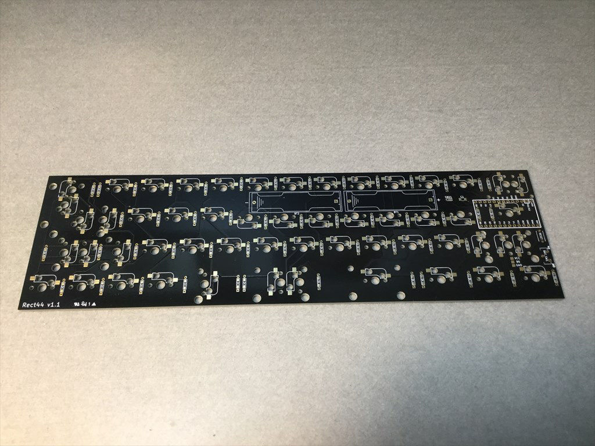
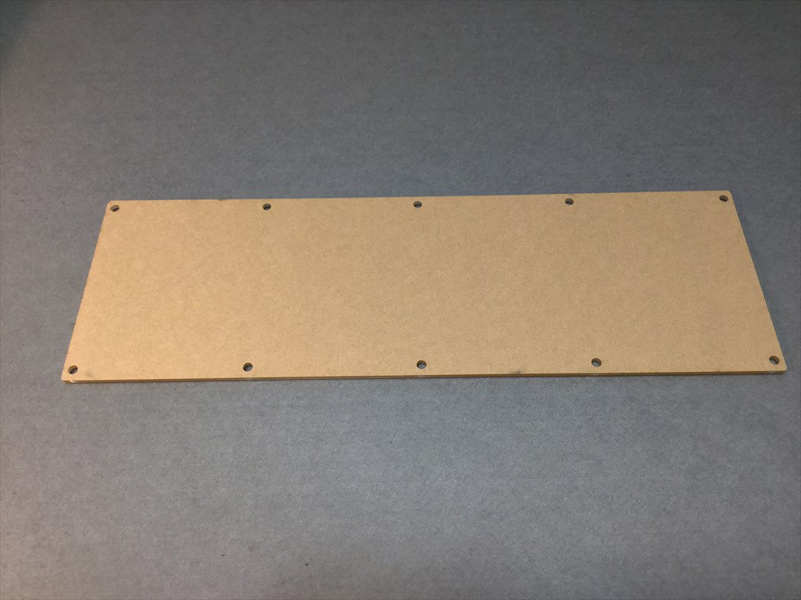
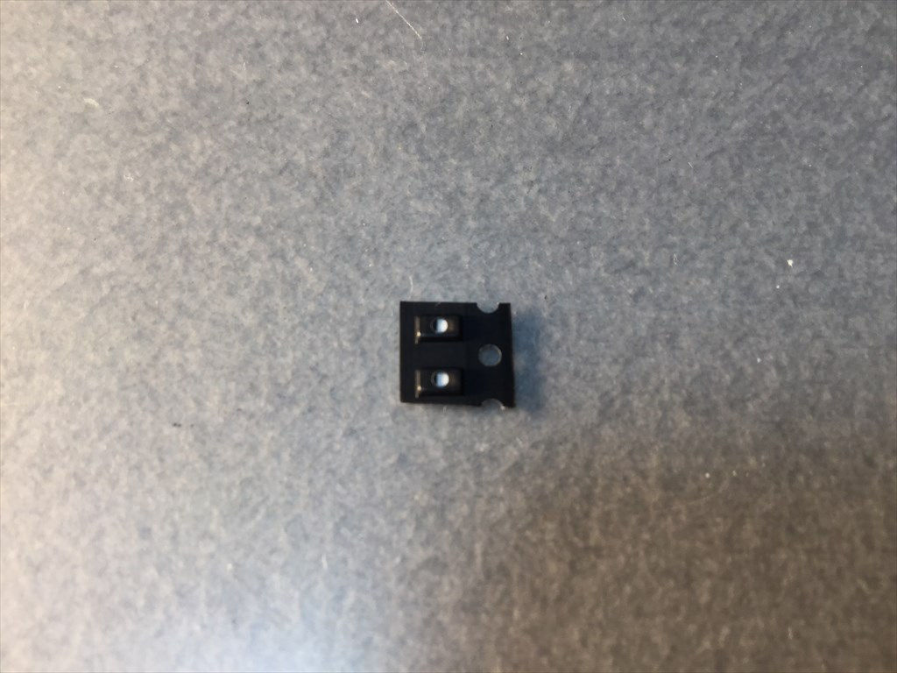
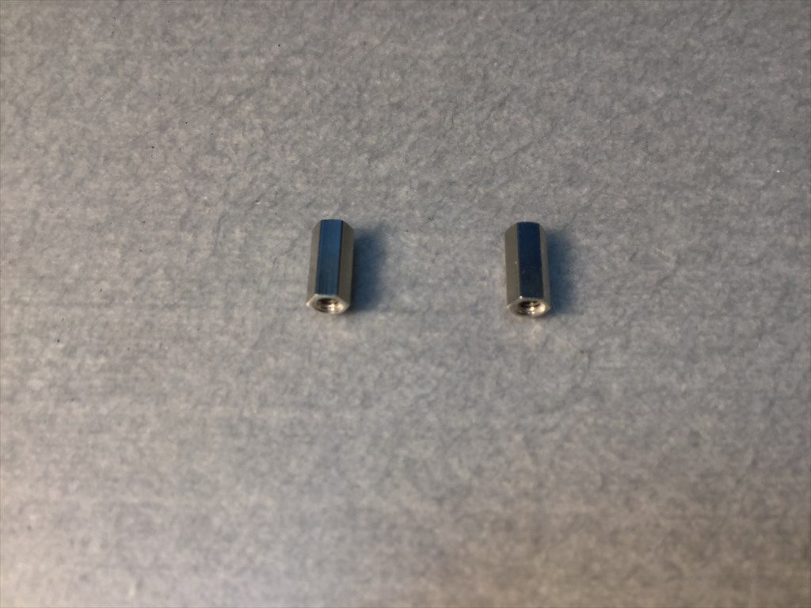

# Rect44 ビルドガイド
***

## 準備
***

### 同梱パーツの確認
- 基板…1枚
- ステンレスケース…1個
- アクリル底板…1枚
- ProMicro脱落防止板…1枚
- MX互換ソケット…54+予備1個
- ダイオード…50+予備2個
- ショットキーバリアダイオード…1+予備1個
- スライドスイッチ…1個
- タクトスイッチ…1個
- 単4電池ケース…2個
- 12pinコンスルー…2本
- M2 7mmスペーサー…2個
- M3 低頭ネジ…10本
- M2 ナベ小ネジ(PW,SW付き)…4本
- クッションシール…4個

|  |  |  |  |
| ---- | ---- | ---- | ---- |
|基板|ステンレスケース|アクリル底板|ProMicro脱落防止板|
|  |  |  |  |
|MX互換ソケット|ダイオード|ショットキーバリアダイオード|スライドスイッチ|
|  |  |  |  |
|タクトスイッチ|単4電池ケース|12pinコンスルー|M2 7mmスペーサー|
|  |  |  ||
|M3 低頭ネジ|M2 ナベ小ねじ|クッションシール| |

### 別途用意するパーツ
- ProMicroもしくはProMicro互換品：1個
- MX互換キースイッチ：レイアウトにより44～48個
- キーキャップ：キースイッチとレイアウトに合わせたもの
- スタビライザー：キースイッチとレイアウトに合わせたもの


### 必要工具
- はんだごて（温度調整機能付き）
- はんだ
- はんだごてを置く台
- フラックス
- フラックス洗浄液
- ピンセット
- ＋ドライバー
- ニッパー


### あった方が良いもの
- テスター
- はんだ吸い取り線
- 逆作用ピンセット
- 虫眼鏡またはルーペ
- ラジオペンチ
- 耐熱作業マット
- マスキングテープ


## ファームウェア
***

おすすめは[「のぎけす屋」](https://nogikes.booth.pm/)さんの[ BLE Micro Pro ](https://nogikes.booth.pm/items/1177319)の使用です。  
ファームウェアをビルドする環境の構築も必要ありませんのでお手軽で、かつ、Bluetooth接続ができるようになります。

### BLE Micro Proを使用する場合
CONFIG.JSN と KEYMAP.JSN を編集してカスタマイズします。  

#### CONFIG.JSN
下記内容をコピペして CONFIG.JSN として任意の場所に保存してください。このファイルはキーマップが変わっても変更する必要はありません。
```
{"config":
	{
		"version":2,
		"device_info":{"vid":"0xFEED","pid":"0x0000","name":"rect44","manufacture":"koshinoya","description":""},
		"matrix":{"rows":4,"cols":13,"device_rows":4, "device_cols":13,
		"debounce":1,"is_left_hand":1,"diode_direction":0,
		"row_pins":[1, 2, 19, 20],
		"col_pins":[18, 17, 16, 15, 14, 5, 6, 7, 8, 9, 10, 11, 12],
		"layout":[1, 2, 3, 4, 5, 6, 7, 8, 9, 10, 11, 12, 13, 0,
			 14, 15, 16, 17, 18, 19, 20, 21, 22, 23, 24, 25, 26, 0,
			 27, 28, 29, 30, 31, 32, 33, 34, 35, 36, 37, 38, 39, 0,
			 40, 41, 42, 43, 45, 46, 48, 49, 50, 51, 52]},
		"mode":"SINGLE","startup":1,
		"peripheral":{"max_interval":60,"min_interval":30,"slave_latency":7},
		"central":{"max_interval":60,"min_interval":30,"slave_latency":0},
		"led":{"pin":255, "num":0},
		"keymap":{"locale":"US","use_ascii":0}
}}
```

#### KEYMAP.JSN
KEYMAP.JSNは選んだレイアウトに合わせてカスタマイズします。
キーコードは[QMK Keycordes](https://docs.qmk.fm/#/keycodes)と同じです。  
[BLE Micro Pro固有のキーコード](https://github.com/sekigon-gonnoc/BLE-Micro-Pro/blob/master/docs/edit_keymap_file.md#ble-micro-pro%E5%9B%BA%E6%9C%89%E3%81%AE%E3%82%AD%E3%83%BC%E3%82%B3%E3%83%BC%E3%83%89)もありますので適宜導入してください。

レイアウトにより使用する、しないが変わるキーは、CONFIG.JSN "layout" セクション中の"13","25","28","38","43","45","46","48"です。
- "13"キー：ANSI配列での右上端のキーです。ISOリターンキーを使用したときには隠れて使用できません。
- "25"キー：ISO配列でのセミコロン右側のキーです。ANSI配列の時2.25uリターンキーを使用した場合には使用できません。ただし、リターンキー("26"キー)を1.25uとすれば使えます。
- "28"キー：左Shiftキーを1.25uと1uキーに分割した場合の1uキーです。
- "38"キー：右Shiftキーを1uと1.75uキーに分割した場合の1uキーです。
- "43"キー：6.25uスペースキーを3分割した場合の左2.25uキーです。
- "45"キー：6.25uスペースキーです。
- "46"キー：6.25uスペースキーを3分割した場合の真ん中2.75uキーです。
- "48"キー：6.25uスペースキーを3分割した場合の右1.25uキーです。

6.25uスペースキーを使ったANSI 44キーの場合のサンプル。
```
{"layers":
[["KC_ESC","KC_Q","KC_W","KC_E","KC_R","KC_T","KC_Y","KC_U","KC_I","KC_O","KC_P","KC_MINS","KC_BSPC",
"LCTL_T(KC_TAB)","KC_A","KC_S","KC_D","KC_F","KC_G","KC_H","KC_J","KC_K","KC_L","KC_SCLN","KC_NO","KC_ENT",
"KC_LSFT","KC_NO","KC_Z","KC_X","KC_C","KC_V","KC_B","KC_N","KC_M","KC_COMM","KC_DOT","KC_NO","RSFT_T(KC_SLSH)",
"LCTL_T(KC_DEL)","KC_LGUI","KC_LALT","KC_NO","LT(_FN,KC_SPC)","KC_NO","KC_NO","KC_LEFT","KC_DOWN","KC_UP","KC_RGHT",],

["KC_GRV","KC_F1","KC_F2","KC_F3","KC_F4","KC_F5","KC_F6","KC_F7","KC_F8","KC_F9","KC_F10","KC_F11","KC_F12",
"KC_TRNS","KC_1","KC_2","KC_3","KC_4","KC_5","KC_6","KC_7","KC_8","KC_9","KC_0","KC_NO","KC_EQL",
"KC_TRNS","KC_NO","KC_APP","MO(_FN2)","KC_NO","KC_NO","KC_LBRC","KC_RBRC","KC_QUOT","KC_TRNS","KC_TRNS","KC_NO","KC_BSLS",
"KC_INS","KC_TRNS","KC_TRNS","KC_NO","KC_TRNS","KC_NO","KC_NO","KC_HOME","KC_PGDN","KC_PGUP","KC_END",],

["ADV_ID0","ADV_ID1","ADV_ID2","ADV_ID3","ADV_ID4","KC_NO","KC_NO","KC_NO","KC_NO","KC_PSCR","KC_SLCK","KC_PAUS","KC_NO",
"KC_CAPS","KC_NO","KC_NO","KC_NO","KC_NO","KC_NO","KC_NO","KC_NO","KC_NO","KC_NO","KC_NO","KC_NO","KC_NO",
"KC_TRNS","KC_NO","KC_NO","KC_TRNS","KC_NO","KC_NO","KC_NO","KC_NO","KC_NO","KC_NO","KC_NO","KC_NO","KC_NO",
"KC_LCTL","KC_TRNS","KC_TRNS","KC_NO","KC_TRNS","KC_NO","KC_NO","KC_NO","KC_NO","KC_NO","KC_NO",]]}
```

スペースキーを3分割にして右Shiftキーも分割したANSI 47キーの場合のサンプル
```
{"layers":
[["KC_ESC","KC_Q","KC_W","KC_E","KC_R","KC_T","KC_Y","KC_U","KC_I","KC_O","KC_P","KC_MINS","KC_BSPC",
"LCTL_T(KC_TAB)","KC_A","KC_S","KC_D","KC_F","KC_G","KC_H","KC_J","KC_K","KC_L","KC_SCLN","KC_NO","KC_ENT",
"KC_LSFT","KC_NO","KC_Z","KC_X","KC_C","KC_V","KC_B","KC_N","KC_M","KC_COMM","KC_DOT","KC_SLSH","RSFT_T(KC_UP)",
"LCTL_T(KC_DEL)","KC_LGUI","KC_LALT","LT(1,KC_SPC)","KC_NO","RSFT_T(KC_SPC)","KC_RALT","MO(2)","KC_LEFT","KC_DOWN","KC_RGHT",],

["KC_GRV","KC_F1","KC_F2","KC_F3","KC_F4","KC_F5","KC_F6","KC_F7","KC_F8","KC_F9","KC_F10","KC_F11","KC_F12",
"KC_TRNS","KC_1","KC_2","KC_3","KC_4","KC_5","KC_6","KC_7","KC_8","KC_9","KC_0","KC_NO","KC_EQL",
"KC_TRNS","KC_NO","KC_APP","KC_NO","KC_NO","KC_NO","KC_LBRC","KC_RBRC","KC_QUOT","KC_TRNS","KC_TRNS","KC_BSLS","RSFT_T(KC_PGUP)",
"LCTL_T(KC_INS)","KC_TRNS","KC_TRNS","KC_TRNS","KC_NO","KC_TRNS","KC_TRNS","KC_TRNS","KC_HOME","KC_PGDN","KC_END",],

["ADV_ID0","ADV_ID1","ADV_ID2","ADV_ID3","ADV_ID4","KC_NO","KC_NO","KC_NO","KC_NO","KC_PSCR","KC_SLCK","KC_PAUS","KC_NO",
"KC_CAPS","KC_NO","KC_NO","KC_NO","KC_NO","KC_NO","KC_NO","KC_NO","KC_NO","KC_NO","KC_NO","KC_NO","KC_NO",
"KC_TRNS","KC_NO","KC_NO","KC_NO","KC_NO","KC_NO","KC_NO","KC_NO","KC_NO","KC_NO","KC_NO","KC_NO","KC_NO",
"KC_LCTL","KC_TRNS","KC_TRNS","KC_NO","KC_NO","KC_NO","KC_NO","KC_TRNS","KC_NO","KC_NO","KC_NO",]]}
```

ISOエンターキーを使った48キーの場合のサンプル
```
{"layers":
[["KC_ESC","KC_Q","KC_W","KC_E","KC_R","KC_T","KC_Y","KC_U","KC_I","KC_O","KC_P","KC_DEL","KC_NO",
"LCTL_T(KC_TAB)","KC_A","KC_S","KC_D","KC_F","KC_G","KC_H","KC_J","KC_K","KC_L","KC_SCLN","KC_QUOT","KC_ENT",
"KC_LSFT","LSFT_T(KC_NUBS)","KC_Z","KC_X","KC_C","KC_V","KC_B","KC_N","KC_M","KC_COMM","KC_DOT","KC_SLSH","RSFT_T(KC_UP)",
"LCTL_T(KC_INS)","KC_LGUI","KC_LALT","LT(1,KC_SPC)","KC_NO","RSFT_T(KC_SPC)","KC_RALT","MO(2)","KC_LEFT","KC_DOWN","KC_RGHT",],

["KC_GRV","KC_F1","KC_F2","KC_F3","KC_F4","KC_F5","KC_F6","KC_F7","KC_F8","KC_F9","KC_F10","KC_BSPC","KC_NO",
"KC_TRNS","KC_1","KC_2","KC_3","KC_4","KC_5","KC_6","KC_7","KC_8","KC_9","KC_0","KC_MINS","KC_EQL",
"KC_TRNS","KC_NO","KC_APP","KC_NO","KC_NO","KC_NO","KC_LBRC","KC_RBRC","KC_NUHS","KC_TRNS","KC_TRNS","KC_BSLS","RSFT_T(KC_PGUP)",
"KC_TRNS","KC_TRNS","KC_TRNS","KC_TRNS","KC_NO","KC_TRNS","KC_TRNS","KC_TRNS","KC_HOME","KC_PGDN","KC_END",],

["ADV_ID0","ADV_ID1","ADV_ID2","ADV_ID3","ADV_ID4","KC_NO","KC_NO","KC_NO","KC_NO","KC_PSCR","KC_SLCK","KC_PAUS","KC_NO",
"KC_CAPS","KC_NO","KC_NO","KC_NO","KC_NO","KC_NO","KC_NO","KC_NO","KC_NO","KC_NO","KC_NO","KC_NO","KC_NO",
"KC_TRNS","KC_NO","KC_NO","KC_NO","KC_NO","KC_NO","KC_NO","KC_NO","KC_NO","KC_NO","KC_NO","KC_NO","KC_NO",
"KC_TRNS","KC_TRNS","KC_TRNS","KC_NO","KC_NO","KC_NO","KC_TRNS","KC_TRNS","KC_NO","KC_NO","KC_NO",]]}
```

上記サンプルのうちお好きなものをコピペして KEYMAP.JSN として保存してください。もちろんカスタマイズもOKです。

#### 書き込み
BLE Micro Pro をUSBケーブルでPCにつなぐとUSBメモリを接続したときのように認識されるので、作成した CONFIG.JSN と KEYMAP.JSN を BLE Micro Pro 側にコピーしてください。

上の図では CONFIG.JSN の "device_info" 中の "name" を rect44-3 としているのでそのように認識されています。

CONFIG.JSN、KEYMAP.JSN は下記リンク先にもありますのでリネームしてご利用ください。  
https://github.com/koshinoya/BLE-Micro-Pro/tree/add_rect44_kb/AboutDefaultFirmware/keyboards/rect44


### ProMicroを使用する場合

#### 環境の構築
基本的にはここ  
[The Complete Newbs Guide To QMK](https://docs.qmk.fm/#/newbs)  
ですが、英語が苦手という方は  

[QMK firmware ファームウェアの初歩の初歩　１](http://roudokuvip.hateblo.jp/entry/2018/04/29/013126)  
がおすすめです。
私はここを参考にして環境構築しました。

#### カスタマイズ
https://github.com/koshinoya/qmk_firmware/tree/add_rect44_keyboard にファームウェア作成用の情報を置きました。適宜編集してご利用ください。


## 組み立て
***

### キースイッチ用ダイオード


### ショットキーバリアダイオード


### ソケット


### 電源スイッチ


### リセットスイッチ


### 電池ボックス


### BLE Micro Pro


### ProMicro


### ProMicro脱落防止板


### スタビライザ


### キースイッチ＆キーキャップ


### 底板
